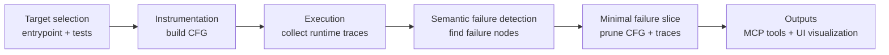
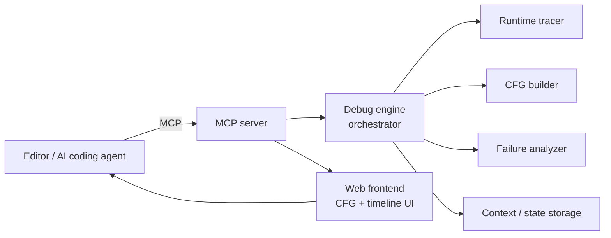

# BugPoint

[Demo](https://github.com/user-attachments/assets/d36b94ed-c0fb-4f3c-9e40-6003bcda3492)

## Problem

Modern AI coding agents are powerful at pattern matching and code generation, but they are effectively blind to how code actually executes. Today they:

- Only see coarse signals like "tests passed" or "stack trace at failure"
- Drown in unstructured logs and text dumps
- Struggle to reason about complex, branching control flow
- Have no precise view of where runtime behavior diverged from intent

This makes it hard for agents (and humans) to debug non-trivial systems, especially when failures depend on subtle runtime state across many basic blocks and files.

---

## Solution

**BugPoint** is an LLM-native debugging layer that shows AI how code actually executed, instead of drowning it in logs. It integrates into your existing workflow and uses program analysis with runtime instrumentation to give precise, structured visibility into real execution paths.

At a high level, BugPoint:

- Builds control-flow graphs (CFGs) to represent program structure
- Instruments code to capture runtime traces at the basic-block level
- Records intermediate variable state along each execution path
- Identifies the exact node(s) where behavior diverges from intent
- Produces minimal, structured "failure slices" for LLMs to reason over

---

## How It Is Different

Compared to traditional debugging and tracing tools, BugPoint focuses on **LLM-friendly, structured views of execution**, not raw logs.

- **Structure over noise**: Emphasizes CFGs and basic blocks instead of line-by-line logs
- **Semantic failure focus**: Highlights where logic broke, not just where an exception was thrown
- **Agent-first design**: Output is designed to be consumed by LLMs as context, not just humans
- **Tight MCP integration**: Integrates directly with Cursor, Claude Code, Windsurf, Zed, and other MCP-capable tools
- **Minimal failure slices**: Compresses large traces into compact, relevant slices that fit within LLM context windows

This makes BugPoint a debugging "lens" that any agent can call, rather than yet another logging system.

---

## Algorithm and Pipeline

BugPoint’s core pipeline can be summarized in six stages.

### Pipeline Diagram



### 1. Target Selection

1. The agent or user selects:
   - A function, file, or entrypoint to debug
   - One or more test cases or reproduction inputs
2. BugPoint resolves the relevant code units and entrypoints.

### 2. Instrumentation and CFG Construction

- Parse the target code into an intermediate representation.
- Build a **control-flow graph (CFG)** where:
  - Nodes are basic blocks (straight-line code without jumps)
  - Edges represent possible control transfers (branches, loops, calls)
- Inject instrumentation at strategic points (block entry/exit, key expressions) to capture:
  - Block identifiers
  - Variable snapshots
  - Branch decisions and call relationships

### 3. Execution and Trace Collection

For each test case or scenario:

- Run the instrumented code inside a controlled environment.
- Collect a **runtime trace** containing:
  - Sequence of CFG nodes visited
  - Variable states at each node
  - Any exceptions or assertion failures
  - Timing or iteration counts where relevant

### 4. Semantic Failure Detection

Using the collected traces, BugPoint:

- Compares expected vs. actual behavior (from tests or specifications).
- Locates the earliest CFG node where:
  - A predicate fails
  - A variable drifts from expected invariants
  - Control flow diverges from the "healthy" path
- Marks these as **failure nodes** and annotates them with:
  - Local code snippet
  - Variable diffs
  - Human- and LLM-readable explanation of what went wrong.

### 5. Minimal Failure Slice Generation

To make the data usable by LLMs:

- Identify the minimal subgraph of the CFG that:
  - Contains the failure nodes
  - Includes only the necessary predecessors and dependencies
- Extract:
  - Relevant code snippets
  - Condensed variable histories
  - A small number of critical paths rather than the whole trace

The result is a **minimal failure slice**: a compact, structured representation of "what mattered" for the bug.

### 6. Packaging for LLMs and UI

Finally, BugPoint:

- Serializes the CFG, traces, and failure slice into structured JSON
- Surfaces this via:
  - **MCP tools** for agent consumption
  - A **web UI** that visualizes the CFG and highlights failure nodes

Agents receive a clean, structured object they can reason over; humans see an interactive visualization they can explore.

## Getting Started (High-Level)

### Prerequisites

- Python 3.12+
- Node.js (for the frontend client)
- An MCP-compatible coding assistant (Cursor, Claude Code, etc.)

### Setup (Conceptual)

1. **Backend (MCP Server)**:
   - Install the Python package in `mcp/`
   - Configure and run the MCP server (see below for MCP config)
2. **Frontend**:
   - Install dependencies in `client/`
   - Run the dev server to view CFGs and traces
3. **Editor Integration**:
   - Configure your editor/agent to connect to the MCP server
   - Use the provided tools to trigger BugPoint during debugging sessions.

### MCP Configuration (Cursor example)

For MCP-aware editors like Cursor, add a server entry in your MCP settings
pointing at your deployed BugPoint server (replace `YOUR_SERVER_URL` with your host):

```json
{
  "mcpServers": {
    "debug-context": {
      "type": "sse",
      "url": "https://YOUR_SERVER_URL/llm_debugger/sse"
    }
  }
}
```

If your client supports HTTP transport instead of SSE:

```json
{
  "mcpServers": {
    "debug-context": {
      "type": "http",
      "url": "https://YOUR_SERVER_URL/llm_debugger",
      "endpoints": {
        "message": "/sse/message",
        "sse": "/sse"
      }
    }
  }
}
```

### IDE / Editor Support

BugPoint is editor-agnostic: as long as your IDE or editor can speak MCP (or call HTTP endpoints), it can use the debugger.
Today it works out of the box with MCP-aware tools like Cursor, Claude Code, Windsurf, and Zed, and can be integrated into any other IDE by pointing it at the running MCP server.

---

## Project Structure (High-Level)

```text
llm-debugger/
├── mcp/                      # MCP server backend and core debugging logic
│   ├── core/                 # Tracing, CFG, analysis, orchestration
│   ├── api/                  # HTTP / MCP API surfaces
│   └── docs/                 # MCP and deployment documentation
├── client/                   # Frontend visualization (React + Vite)
│   └── src/                  # CFG, timeline, and inspector components
└── attachments/              # Demo videos and assets (e.g., bugpoint-demo.mp4)
```

### High-Level Architecture Diagram



---

## Citations

This project is heavily inspired by **Large Language Model Debugger (LDB)**, which first demonstrated the value of segmenting programs into basic blocks and using runtime execution information for LLM-guided debugging:

- Li Zhong, Zilong Wang, and Jingbo Shang. 2024. **Debug like a Human: A Large Language Model Debugger via Verifying Runtime Execution Step by Step.** In *Findings of the Association for Computational Linguistics: ACL 2024*, pages 851–870, Bangkok, Thailand. Association for Computational Linguistics. [`https://aclanthology.org/2024.findings-acl.49/`](https://aclanthology.org/2024.findings-acl.49/)  \[[DOI: 10.18653/v1/2024.findings-acl.49](https://doi.org/10.18653/v1/2024.findings-acl.49)\]

```bibtex
@inproceedings{zhong-etal-2024-debug,
  title     = {Debug like a Human: A Large Language Model Debugger via Verifying Runtime Execution Step by Step},
  author    = {Zhong, Li and Wang, Zilong and Shang, Jingbo},
  booktitle = {Findings of the Association for Computational Linguistics: ACL 2024},
  year      = {2024},
  address   = {Bangkok, Thailand},
  publisher = {Association for Computational Linguistics},
  pages     = {851--870},
  url       = {https://aclanthology.org/2024.findings-acl.49/},
  doi       = {10.18653/v1/2024.findings-acl.49}
}
```
